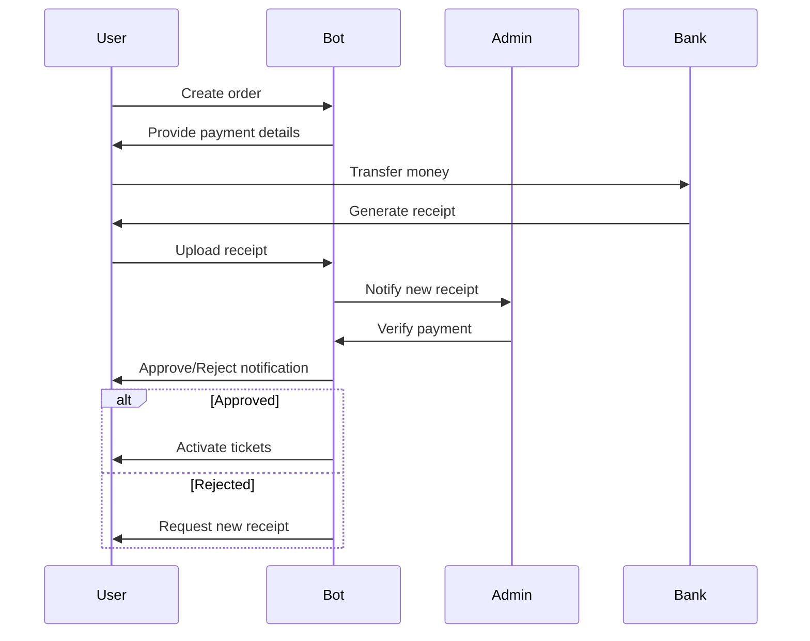

## Payment overview

The Bahodir Brat Lottery Bot uses a manual payment verification system with Russian bank cards to ensure security and compliance.

<CardGroup cols={2}>
<Card title="Supported banks" icon="building-columns">
  Sberbank, Tinkoff, VTB, Alfa-Bank
</Card>

<Card title="Verification" icon="check-circle">
  Manual admin review of all payments
</Card>

<Card title="Receipt upload" icon="image">
  Photo proof required for verification
</Card>

<Card title="Processing time" icon="clock">
  1-24 hours typical verification
</Card>
</CardGroup>

## Supported payment methods

### Russian bank cards only

<Tabs>
<Tab title="Sberbank">
  **Russia's largest bank**
  
  - Card types: Visa, Mastercard, Mir
  - Transfer speed: Instant
  - Availability: 24/7
  - Mobile app: Sberbank Online
  
  **Advantages:**
  - Most widely used
  - Reliable infrastructure
  - Fast processing
  - Easy verification
</Tab>

<Tab title="Tinkoff">
  **Leading digital bank**
  
  - Card types: Mastercard, Mir
  - Transfer speed: Instant
  - Availability: 24/7
  - Mobile app: Tinkoff
  
  **Advantages:**
  - Modern interface
  - Quick transfers
  - Detailed receipts
  - 24/7 support
</Tab>

<Tab title="VTB">
  **Major Russian bank**
  
  - Card types: Visa, Mastercard, Mir
  - Transfer speed: Instant
  - Availability: 24/7
  - Mobile app: VTB Online
  
  **Advantages:**
  - Wide network
  - Stable service
  - Corporate backing
  - Good security
</Tab>

<Tab title="Alfa-Bank">
  **Private banking leader**
  
  - Card types: Visa, Mastercard, Mir
  - Transfer speed: Instant
  - Availability: 24/7
  - Mobile app: Alfa-Mobile
  
  **Advantages:**
  - Premium service
  - High limits
  - Fast support
  - Modern features
</Tab>
</Tabs>

<Warning>
Only transfers from Russian bank cards are accepted. International cards and other payment methods are not supported.
</Warning>

## Payment workflow

### Complete payment process



### Step-by-step process

<Steps>
<Step title="Order creation">
  User creates an order in the bot:
  
  ```python
  # Backend: Create order
  @router.post("/orders")
  async def create_order(
      order_data: OrderCreate,
      current_user: User = Depends(get_current_user)
  ):
      # Calculate total amount
      ticket_prices = {
          "standard": lottery.ticket_price_standard,
          "gold": lottery.ticket_price_gold,
          "vip": lottery.ticket_price_vip
      }
      
      total_amount = ticket_prices[order_data.tier] * order_data.quantity
      
      # Create order
      order = Order(
          user_id=current_user.id,
          lottery_draw_id=order_data.lottery_id,
          ticket_tier=order_data.tier,
          ticket_count=order_data.quantity,
          total_amount=total_amount,
          status="pending"
      )
      
      db.add(order)
      db.commit()
      
      # Get payment card
      payment_card = get_active_payment_card()
      
      return {
          "order": order,
          "payment_details": {
              "card_number": payment_card.number,
              "bank": payment_card.bank,
              "amount": total_amount,
              "order_id": order.id
          }
      }
  ```
</Step>

<Step title="Payment transfer">
  User transfers money via their bank app:
  
  <Tabs>
  <Tab title="Sberbank Online">
    1. Open Sberbank Online app
    2. Go to "Transfers" → "To card"
    3. Enter recipient card number
    4. Enter exact amount
    5. Add comment: "Order #12345"
    6. Confirm transfer
    7. Save receipt screenshot
  </Tab>
  
  <Tab title="Tinkoff">
    1. Open Tinkoff app
    2. Tap "Payments" → "To card"
    3. Enter card number
    4. Enter amount
    5. Add purpose: "Order #12345"
    6. Confirm with SMS code
    7. Screenshot receipt
  </Tab>
  
  <Tab title="VTB Online">
    1. Open VTB Online app
    2. Select "Transfers"
    3. Choose "To another card"
    4. Enter details
    5. Confirm transfer
    6. Save receipt
  </Tab>
  </Tabs>
  
  <Warning>
  Transfer the EXACT amount shown. Even 1 RUB difference will cause rejection.
  </Warning>
</Step>

<Step title="Receipt upload">
  User uploads payment receipt:
  
  ```python
  # Backend: Upload receipt
  @router.post("/orders/{order_id}/upload-receipt")
  async def upload_receipt(
      order_id: int,
      receipt: UploadFile = File(...),
      current_user: User = Depends(get_current_user)
  ):
      # Validate order
      order = db.query(Order).filter(
          Order.id == order_id,
          Order.user_id == current_user.id
      ).first()
      
      if not order:
          raise HTTPException(status_code=404, detail="Order not found")
      
      # Validate file
      if receipt.content_type not in ["image/jpeg", "image/png"]:
          raise HTTPException(status_code=400, detail="Invalid file type")
      
      if receipt.size > 5 * 1024 * 1024:  # 5MB
          raise HTTPException(status_code=400, detail="File too large")
      
      # Save file
      file_path = f"uploads/receipts/{order_id}_{int(time.time())}.jpg"
      with open(file_path, "wb") as f:
          f.write(await receipt.read())
      
      # Update order
      order.receipt_url = file_path
      order.status = "pending_verification"
      order.updated_at = datetime.now()
      db.commit()
      
      # Notify admin
      await notify_admin_new_receipt(order_id)
      
      return {"message": "Receipt uploaded successfully"}
  ```
</Step>

<Step title="Admin verification">
  Admin reviews and verifies payment:
  
  ```python
  # Backend: Verify payment
  @router.post("/admin/orders/{order_id}/verify")
  async def verify_payment(
      order_id: int,
      verification: PaymentVerification,
      current_user: User = Depends(get_current_admin)
  ):
      order = db.query(Order).filter(Order.id == order_id).first()
      
      if verification.approved:
          # Approve payment
          order.status = "approved"
          order.verified_by = current_user.id
          order.verified_at = datetime.now()
          
          # Create tickets
          tickets = []
          for i in range(order.ticket_count):
              ticket = Ticket(
                  order_id=order.id,
                  user_id=order.user_id,
                  lottery_draw_id=order.lottery_draw_id,
                  ticket_number=generate_ticket_number(order.ticket_tier),
                  tier=order.ticket_tier,
                  is_active=True
              )
              tickets.append(ticket)
          
          db.add_all(tickets)
          
          # Notify user
          await send_telegram_notification(
              order.user_id,
              NOTIFICATION_TEMPLATES["payment_approved"].format(
                  order_id=order.id,
                  amount=order.total_amount,
                  ticket_count=order.ticket_count
              )
          )
          
      else:
          # Reject payment
          order.status = "rejected"
          order.rejection_reason = verification.reason
          order.verified_by = current_user.id
          order.verified_at = datetime.now()
          
          # Notify user
          await send_telegram_notification(
              order.user_id,
              NOTIFICATION_TEMPLATES["payment_rejected"].format(
                  order_id=order.id,
                  reason=verification.reason
              )
          )
      
      db.commit()
      
      # Log action
      await log_admin_action(
          admin_id=current_user.id,
          action="verify_payment",
          details=f"Order #{order_id}: {'Approved' if verification.approved else 'Rejected'}"
      )
      
      return {"message": "Verification completed"}
  ```
</Step>

<Step title="Ticket activation">
  If approved, tickets are automatically activated:
  
  ```python
  def generate_ticket_number(tier: str) -> str:
      """Generate unique ticket number"""
      prefix = {
          "standard": "STD",
          "gold": "GOLD",
          "vip": "VIP"
      }[tier]
      
      # Generate unique number
      timestamp = int(time.time())
      random_num = random.randint(10000, 99999)
      
      return f"{prefix}-{timestamp}{random_num}"
  ```
</Step>
</Steps>

## Receipt requirements

### Required information

All payment receipts must clearly show:

<AccordionGroup>
<Accordion title="1. Card number">
  **Requirement:** Last 4 digits of recipient card must be visible
  
  **Example:**
  ```
  To card: •••• •••• •••• 1234
  ```
  
  **Why:** Verifies payment went to correct card
</Accordion>

<Accordion title="2. Transfer amount">
  **Requirement:** Exact amount must match order total
  
  **Example:**
  ```
  Amount: 15,000.00 RUB
  ```
  
  **Why:** Confirms correct payment amount
  
  <Warning>
  Even 1 RUB difference will cause rejection
  </Warning>
</Accordion>

<Accordion title="3. Date and time">
  **Requirement:** Transaction timestamp must be visible
  
  **Example:**
  ```
  Date: 20.01.2024
  Time: 14:30:25
  ```
  
  **Why:** Validates payment timing
</Accordion>

<Accordion title="4. Transaction ID">
  **Requirement:** Unique transaction identifier
  
  **Example:**
  ```
  Transaction: 1234567890ABCDEF
  or
  Reference: 987654321
  ```
  
  **Why:** Prevents duplicate submissions
</Accordion>

<Accordion title="5. Bank/payment system">
  **Requirement:** Bank name or payment system logo
  
  **Example:**
  ```
  Sberbank Online
  or
  [Tinkoff Logo]
  ```
  
  **Why:** Confirms legitimate source
</Accordion>
</AccordionGroup>

### Photo quality standards

<Tabs>
<Tab title="✅ Good receipt">
  **Characteristics:**
  - All text clearly readable
  - No blur or motion
  - Good lighting
  - All corners visible
  - No glare on screen
  - Proper orientation
  
  **Example checklist:**
  - [x] Card number visible
  - [x] Amount clear
  - [x] Date/time shown
  - [x] Transaction ID present
  - [x] Bank name visible
  - [x] No editing/tampering
</Tab>

<Tab title="❌ Bad receipt">
  **Common issues:**
  - Blurry or out of focus
  - Poor lighting (too dark/bright)
  - Glare obscuring details
  - Cropped information
  - Wrong orientation
  - Edited or tampered
  
  **Will be rejected:**
  - [ ] Can't read card number
  - [ ] Amount unclear
  - [ ] Missing timestamp
  - [ ] No transaction ID
  - [ ] Suspicious editing
</Tab>
</Tabs>

### File specifications

```
📸 RECEIPT FILE REQUIREMENTS

Format: JPG or PNG only
Max Size: 5 MB
Min Resolution: 800x600 pixels
Max Resolution: 4096x4096 pixels
Color: RGB (color photos preferred)
Compression: Standard (not over-compressed)
```

<Note>
Screenshots from banking apps are preferred over photos of computer screens.
</Note>

## Payment card management

### Admin: Adding payment cards

<Steps>
<Step title="Navigate to settings">
  Go to Admin Panel → Settings → Payment Cards
</Step>

<Step title="Add new card">
  ```
  ➕ ADD PAYMENT CARD
  
  Bank: [Sberbank ▼]
  
  Card Number: [2202 2063 1234 5678]
  
  Card Holder: [IVANOV IVAN IVANOVICH]
  
  Status:
  (•) Active
  ( ) Inactive
  
  Daily Limit: [1000000] RUB
  
  Notes:
  [Primary card for VIP orders]
  
  [Add Card] [Cancel]
  ```
</Step>

<Step title="Card rotation">
  System automatically rotates between active cards:
  
  ```python
  def get_active_payment_card():
      """Get next available payment card using round-robin"""
      cards = db.query(PaymentCard).filter(
          PaymentCard.is_active == True
      ).all()
      
      if not cards:
          raise Exception("No active payment cards")
      
      # Round-robin selection
      last_used = redis_client.get("last_used_card_id")
      
      if last_used:
          # Get next card
          current_index = next(
              i for i, card in enumerate(cards) 
              if card.id == int(last_used)
          )
          next_index = (current_index + 1) % len(cards)
          selected_card = cards[next_index]
      else:
          # Use first card
          selected_card = cards[0]
      
      # Update last used
      redis_client.set("last_used_card_id", selected_card.id)
      
      return selected_card
  ```
</Step>
</Steps>

### Card limits and monitoring

```python
# Check daily card limit
async def check_card_limit(card_id: int, amount: Decimal) -> bool:
    """Check if card has available limit"""
    today = datetime.now().date()
    
    # Get today's total
    today_total = db.query(func.sum(Order.total_amount)).filter(
        Order.payment_card_id == card_id,
        Order.status == "approved",
        func.date(Order.created_at) == today
    ).scalar() or 0
    
    card = db.query(PaymentCard).filter(PaymentCard.id == card_id).first()
    
    return (today_total + amount) <= card.daily_limit
```

## Payment security

### Fraud prevention

<AccordionGroup>
<Accordion title="Duplicate detection">
  ```python
  async def check_duplicate_payment(
      order_id: int,
      receipt_hash: str
  ) -> bool:
      """Check if receipt was already used"""
      existing = db.query(Order).filter(
          Order.id != order_id,
          Order.receipt_hash == receipt_hash,
          Order.status.in_(["approved", "pending_verification"])
      ).first()
      
      return existing is not None
  ```
  
  System checks:
  - Receipt image hash
  - Transaction ID
  - Amount + timestamp combination
</Accordion>

<Accordion title="Amount validation">
  ```python
  def validate_payment_amount(
      order: Order,
      receipt_amount: Decimal
  ) -> bool:
      """Validate receipt amount matches order"""
      # Allow 0.01 RUB tolerance for rounding
      tolerance = Decimal("0.01")
      difference = abs(order.total_amount - receipt_amount)
      
      return difference <= tolerance
  ```
</Accordion>

<Accordion title="Time window validation">
  ```python
  def validate_payment_timing(
      order_created: datetime,
      payment_time: datetime
  ) -> bool:
      """Validate payment was made after order creation"""
      # Payment must be within 48 hours of order
      time_diff = payment_time - order_created
      
      return timedelta(0) <= time_diff <= timedelta(hours=48)
  ```
</Accordion>

<Accordion title="User behavior analysis">
  ```python
  async def analyze_user_behavior(user_id: int) -> dict:
      """Analyze user payment patterns for fraud detection"""
      # Get user's order history
      orders = db.query(Order).filter(
          Order.user_id == user_id
      ).all()
      
      # Calculate metrics
      total_orders = len(orders)
      approved_orders = len([o for o in orders if o.status == "approved"])
      rejected_orders = len([o for o in orders if o.status == "rejected"])
      
      approval_rate = approved_orders / total_orders if total_orders > 0 else 0
      
      # Flag suspicious behavior
      is_suspicious = (
          rejection_rate > 0.5 or  # More than 50% rejections
          total_orders > 10 and approval_rate == 0  # Many orders, none approved
      )
      
      return {
          "total_orders": total_orders,
          "approval_rate": approval_rate,
          "is_suspicious": is_suspicious
      }
  ```
</Accordion>
</AccordionGroup>

### Admin verification checklist

Admins should verify:

```
✅ PAYMENT VERIFICATION CHECKLIST

Receipt Quality:
[ ] Photo is clear and readable
[ ] All required information visible
[ ] No signs of editing/tampering
[ ] Proper file format and size

Payment Details:
[ ] Card number matches (last 4 digits)
[ ] Amount exactly matches order total
[ ] Transaction date is recent and valid
[ ] Transaction ID is unique
[ ] Bank name is visible

Order Validation:
[ ] Order exists and is pending
[ ] User account is active
[ ] Lottery draw is still accepting tickets
[ ] No duplicate receipts

User History:
[ ] Check user's previous orders
[ ] Review approval/rejection rate
[ ] Look for suspicious patterns
[ ] Verify user is not banned

Final Decision:
( ) Approve - All checks passed
( ) Reject - Specify reason
( ) Flag for review - Suspicious activity
```

## Refund process

### When refunds are issued

<Tabs>
<Tab title="Lottery cancelled">
  If a lottery draw is cancelled:
  
  ```python
  async def process_lottery_cancellation_refunds(lottery_id: int):
      """Refund all orders for cancelled lottery"""
      orders = db.query(Order).filter(
          Order.lottery_draw_id == lottery_id,
          Order.status == "approved"
      ).all()
      
      for order in orders:
          # Create refund record
          refund = Refund(
              order_id=order.id,
              user_id=order.user_id,
              amount=order.total_amount,
              reason="Lottery cancelled",
              status="pending"
          )
          db.add(refund)
          
          # Notify user
          await send_telegram_notification(
              order.user_id,
              f"Lotereya bekor qilindi. {order.total_amount} RUB qaytariladi."
          )
      
      db.commit()
  ```
</Tab>

<Tab title="Payment error">
  If payment was incorrectly approved:
  
  ```python
  async def process_error_refund(order_id: int, reason: str):
      """Process refund for payment error"""
      order = db.query(Order).filter(Order.id == order_id).first()
      
      # Deactivate tickets
      db.query(Ticket).filter(
          Ticket.order_id == order_id
      ).update({"is_active": False})
      
      # Create refund
      refund = Refund(
          order_id=order.id,
          user_id=order.user_id,
          amount=order.total_amount,
          reason=reason,
          status="approved"
      )
      db.add(refund)
      
      # Update order
      order.status = "refunded"
      
      db.commit()
  ```
</Tab>

<Tab title="User request">
  User-requested refunds (before draw):
  
  ```
  Refund Policy:
  • Before lottery starts: Full refund
  • After lottery starts: No refund
  • Processing time: 3-5 business days
  • Method: Return to original card
  ```
</Tab>
</Tabs>

## Payment statistics

### Revenue tracking

```python
# Get revenue statistics
@router.get("/admin/statistics/revenue")
async def get_revenue_statistics(
    start_date: date,
    end_date: date,
    current_user: User = Depends(get_current_admin)
):
    """Get revenue statistics for date range"""
    
    # Total revenue
    total_revenue = db.query(func.sum(Order.total_amount)).filter(
        Order.status == "approved",
        Order.created_at >= start_date,
        Order.created_at <= end_date
    ).scalar() or 0
    
    # Revenue by tier
    revenue_by_tier = db.query(
        Order.ticket_tier,
        func.sum(Order.total_amount).label("revenue"),
        func.count(Order.id).label("orders")
    ).filter(
        Order.status == "approved",
        Order.created_at >= start_date,
        Order.created_at <= end_date
    ).group_by(Order.ticket_tier).all()
    
    # Revenue by payment method
    revenue_by_bank = db.query(
        PaymentCard.bank,
        func.sum(Order.total_amount).label("revenue")
    ).join(
        Order, Order.payment_card_id == PaymentCard.id
    ).filter(
        Order.status == "approved",
        Order.created_at >= start_date,
        Order.created_at <= end_date
    ).group_by(PaymentCard.bank).all()
    
    return {
        "total_revenue": total_revenue,
        "revenue_by_tier": revenue_by_tier,
        "revenue_by_bank": revenue_by_bank
    }
```

<Note>
All payment data is encrypted at rest and in transit. Financial reports are only accessible to Super Admins.
</Note>
